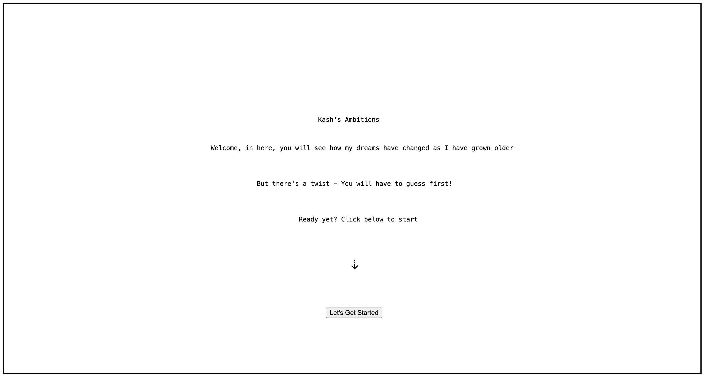

# links to Projects - commlab f25

### below is the link to all the projects I have created for the class! 

* [shanzhai project](https://kashif-08.github.io/CommLab/shanzhai-web/)

in this project, I cloned chatgpt but it becomes evil and turns against Sam Altman himself

* [tutorial project](https://kashif-08.github.io/CommLab/tutorial/)

think about a tutorial that you don't need? this is what I explored in this project. I looked at how we can google something BUT without googling it 

* [first website](https://kashif-08.github.io/CommLab/my-first-website/)

this was the first project of the course. with only html, i created a fun questionnaire about my dreams and how they have changed over the years

