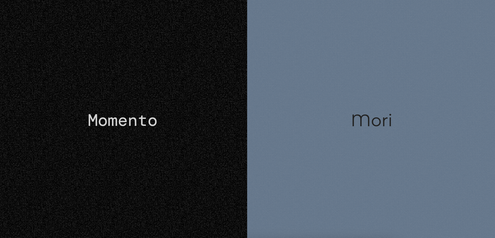

#### Kashif Iftikhar

# Memento Mori

## Christopher Nolan’s Memento reimagined as a website

📸 img: Homepage

This project adapts Christopher Nolan’s Memento into a web-based storytelling experience. The website mirrors the film’s structure by presenting two timelines – one moving forward and one in reverse – through synchronized but opposing scrolls.

### Abstract:

For this project, I adapted Christopher Nolan’s psychological thriller Memento. The film follows a man with anterograde amnesia—the inability to form new memories—as he searches for the person who attacked him and killed his wife. It tells the story through two timelines: a color sequence that moves backward, and a black-and-white sequence that moves forward, meeting at the same moment in the middle. Re-creating this structure on the web was a challenge because the story depends on how time is arranged. To keep the film’s approach, I designed a split webpage with a “multi-reverse scroll.” The black-and-white side scrolls upward in normal order, while the color side scrolls downward in reverse. At any moment, the viewer sees only one side, allowing the website to mimic the film’s jumps between timelines.

