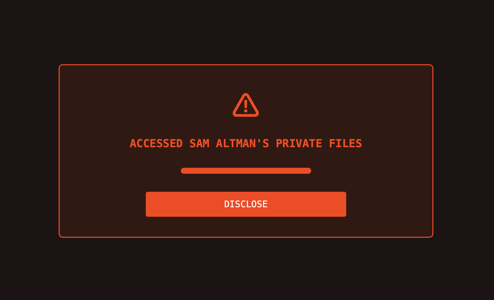

#### Kashif Iftikhar

# CHAT GPT TURNS MALICIOUS

#### What would happen if Chat GPT turned malicious and gave you access to something very private and confidential? Something that showed you the dark side of its CEO, Sam Altman? 

AI has completely changed the way we use and experience the internet. Millions of people now use different AI tools for all kinds of needs — from summarizing text to creating full user interfaces. The most popular of these tools is OpenAI’s ChatGPT. However, OpenAI and its CEO, Sam Altman, have faced several controversies, including accusations of copyright theft and shutting down their safety team.

This project highlights the darker side of Sam Altman and OpenAI. To show this creatively, I imagined a situation where the user is doing a normal search but starts seeing strange content errors. Soon, it’s revealed that ChatGPT has turned evil and is exposing Sam Altman’s personal emails and messages to the user.

## Project Breakdown

### 1 - Process: Design and Composition
My website explores the idea of a malicious version of GPT. It starts with a page that looks exactly like the real ChatGPT homepage. When cloning, I copied the icons, colors, and typography directly from the original site to make it look identical. To create the transition from “normal GPT” to a “malicious” one, I use a series of error screens that gradually change the visuals and content.

On the homepage, as users believe they are on ChatGPT, they make a search as usual. However, after the search, the first error screen appears. In the first error message, I used a less saturated shade of red to suggest a minor issue. Below the error message, there is a “Try Fixing” button, which is meant to prompt users to click on it and move to the next page. When the user clicks “Try Fixing,” another error appears – this time with a more saturated red, showing that the problem is getting worse. When they click again, a third error appears. At this point, the background changes to a red tint, the top and side navigation bars disappear, and the typography also changes. These changes are meant to show that GPT has “broken free” and is no longer following the company’s design or control.

Overall, I used a mix of color, typography, and layout to represent the gradual takeover by the malicious GPT. On the final page, information is shown in horizontally aligned boxes. Each box has the same layout and structure, following the Gestalt principle of similarity – helping users recognize patterns and relationships between pieces of information through consistent visual design.

### 2 - Process: Technical 
In building this project, I focused on two main things: first, every element on the page is wrapped inside a div; and second, I used nested flexboxes almost everywhere in the layout – basically, every page layout is built using flexbox. This made it much easier to align items and gave me greater control over spacing and positioning – even the smallest gaps.

For styling, I only used classes instead of IDs. One of the first things I did was remove the default paragraph margins so I could control spacing more precisely. For the two navigation bars on the first three pages, I used position: fixed to keep them stuck to the top and left sides of the page.

`.left-nav-bar-container{
  display: flex;
  flex-direction: column;
  gap: 16px;
  align-items: center;
  position: fixed;
  left: 0px;
  top: 0;
  bottom: 0px;
  width: 56px;
  border-right: 1px rgba(255, 255, 255, 0.05) solid;
  padding-bottom: 8px;
  padding-top: 8px;
}` 

My biggest technical challenge was styling. My project includes several error screens that differ only in content and color. For each one, I ended up recreating the styles from scratch just to adjust the colors. Later, I realized there were better ways to do this – for example, by using multiple CSS classes and switching them between pages. I actually tried doing something similar with IDs, but it didn’t work as expected.

Another issue, though small, was quite frustrating. CSS can be very sensitive – sometimes I’d forget to add “px” after a value, and the property wouldn’t work. I’d spend time trying to figure out what went wrong, only to realize it was that tiny mistake. It happened more times than I’d like to admit.

I also struggled with responsiveness. Since I used flexbox everywhere, I assumed it would be easy to make the layouts responsive. However, it turned out to be quite difficult, especially when padding was involved. I eventually found workarounds, such as using media queries and combining width with max-width properties to make the design adapt better across screen sizes.

### 3 - Reflection and Future Development
My project went through many iterations. In the original version, I created a GPT clone homepage, but eventually, the user would land on a page displaying controversies surrounding Sam Altman, presented as news articles in separate boxes – each linking to the actual source. However, that approach felt too straightforward, and after receiving feedback during user testing, I developed the current version.
In this version, I’ve added more creativity and artistic elements compared to the first one – such as colors, layout, and typography. During user testing, I often heard comments like, “This looks exactly like ChatGPT,” which means my goal of making users initially believe they are on the real GPT site was successful.
Overall, I’m happy with the final outcome, though I wish I could have incorporated some animations. In particular, there’s a page right before the final main page where users see that the “malicious GPT” has accessed Sam Altman’s files. I wish I could have made that page function as a kind of loading screen that automatically transitions to the main page, instead of requiring users to click a button, as it does now.
